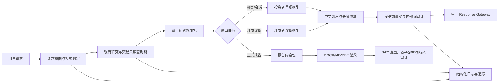
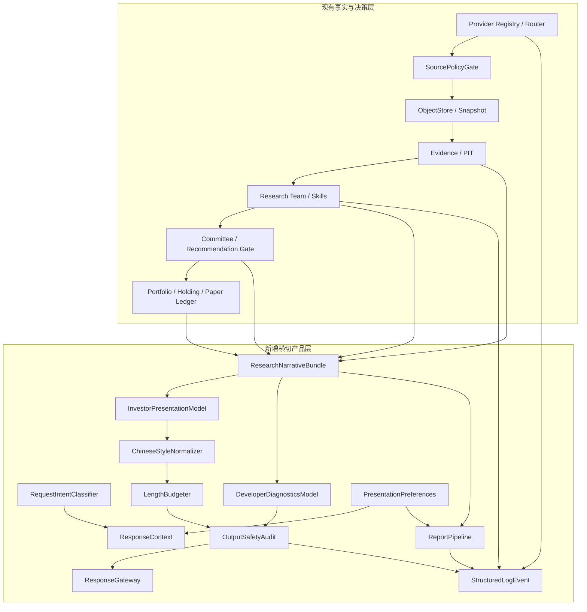

# AStockMultiAgent 系统体验与投研能力深度研究报告

> 文档性质：现状审计、架构论证与实施决策依据
> 审计基线：`main` 分支，2026-08-31
> 研究边界：本报告不修改业务代码，不改变交易权限，不构成投资建议
> 适用范围：AStockMultiAgent 的用户输出、研究链、数据生态、运行保障、报告交付与后续开发计划

---

## 1. 执行摘要

### 1.1 总体判断

AStockMultiAgent 已经具备一套较完整的低成本 A 股研究内核：不可变快照、PIT、Evidence、ObjectStore、正式财务报告回源、Research Team、独立 Bull/Bear/Reviewer、推荐准入、组合风险、持续监控、模拟账本、人工确认和真实券商隔离均已形成明确边界。当前最突出的问题并不是“缺少更多 Agent”，也不是“缺少一个更会写作的大模型”，而是**成熟的内部研究工件没有经过统一、强制、面向投资者的产品投影层**。

用户反馈的三类问题均真实存在：

1. **内部信息泄漏不是规则缺失，而是出口未统一。** 仓库文档已经规定投资者默认只看结论，但代码中的答案审计需要显式调用，Investor Mode 与 Developer Mode 没有形成统一的运行时类型和出口中间件，CLI 仍可直接序列化结构化对象。
2. **中文表达治理停留在局部词表和提示词。** 现有内部词汇审计有价值，但覆盖面有限；缺少项目级中文风格合同、事实保持检查、术语解释规则、标题和标点规则、长度预算及所有出口的发送前门禁。
3. **正式报告能力尚未产品化。** 当前依赖、路径配置和状态模型中没有 DOCX 模板、报告清单、桌面目录解析、引用与图片清单、原子发布、报告偏好或失败回退能力。

此外，本次审计发现四项应优先处理的系统性缺陷：

| 优先级 | 缺陷 | 主要影响 | 结论 |
|---|---|---|---|
| P0 | 投资者/开发者模式仅在文档与提示词中存在，所有用户出口未被统一 Response Gateway 包住 | 内部字段、阶段、状态码、Provider、数据库与 CLI 信息仍可能直出 | 必须建设单一发送出口，默认 Investor Mode，开发诊断显式开启 |
| P0 | 日志层没有成为被隐藏诊断信息的统一承载面 | 隐藏内部信息后可能失去排障能力，错误摘要与真实故障链无法同时满足 | 必须建设结构化、可关联、可脱敏、可保留的分层日志与错误边界 |
| P0 | 自动解决预算存在 1800 秒与 7200 秒配置漂移 | 不同入口等待行为、资源消耗和回答体验不一致 | 必须收敛到单一政策源并在启动时校验 |
| P1 | “全市场正式覆盖”可由二级源自报分母达到 99.5% 后成立 | 高覆盖率被表述为绝对完整，正式荐股的 Universe 证明强度不足 | 必须区分“工程高覆盖”和“官方分母对账完成” |

### 1.2 目标方案

本报告建议新增一层横切产品架构，但不新建第二套事实源、Router、Evidence、账本、用户持仓或 Agent 调度系统：

该架构的核心原则是：

- **事实只生成一次。** 网页短答、开发诊断和正式报告都消费同一组冻结研究事实。
- **默认不暴露内部实现。** 只有用户明确表达调试、排查、测试、日志、状态码、工件、数据库或接口错误等意图时，才进入 Developer Mode。
- **提示词不是最后一道门。** 模式、字段投影、长度、禁用词、事实保持和错误摘要由确定性代码执行。
- **详细诊断不消失，而是进入日志。** 用户只看到影响和下一步；内部保留失败分类、重试、回退、调用链和关联号。
- **外部 Skills、MCP 和平台只能接入现有治理链。** 它们不能直接成为正式事实，也不能绕过 SourcePolicyGate、Provider Registry、快照、PIT、Evidence 和推荐准入。

### 1.3 优先级结论

必须先做用户出口、日志和政策一致性，再扩大外部数据和报告能力。继续增加 Agent、继续复制提示词或引入一个通用 Humanizer，无法解决根因，反而会增加事实漂移和维护成本。

---

## 2. 当前系统事实与问题证据

### 2.1 已经存在且应保留的能力

| 能力 | 当前事实 | 审计结论 |
|---|---|---|
| 不可变事实链 | SourceSnapshot、ObjectStore、Artifact Registry、Evidence 和对象哈希已形成持久化链 | 保留，所有新展示和报告能力只能消费该事实链 |
| PIT 与可用时间 | 已区分 reference time、published time、available-to-system time，并具备 temporal audit | 保留，外部适配器必须补齐相同字段 |
| 正式财务事实 | 结构化数据只作解析与交叉核验，正式财务可回到官方 PDF 并重构 | 保留，不引入第二套财务事实库 |
| 研究职责分离 | 宏观、行业、治理、财务、估值、催化剂、红队、模型风险等职责已拆分 | 保留，新增 Agent 前先证明现有角色有稳定覆盖缺口 |
| 推荐准入 | 候选、研究、投委会、推荐和模拟执行之间存在硬门 | 保留，外部工具不得获得推荐或交易权限 |
| 模拟交易安全 | 订单、成交、持仓和确认分离；真实券商执行被禁止 | 保留，不因本轮体验重构改变安全边界 |
| 持仓与监控恢复 | 本地账本、checkpoint、租约、幂等和增量监控已存在 | 保留，但需补长期运行证据和统一可观测性 |
| 投资者答案审计 | 已有内部词、长度、项目符号和重复句检查 | 复用算法思想，但必须从显式命令升级为强制出口门禁 |

### 2.2 用户反馈的逐项核验

#### 2.2.1 内部信息暴露：真实存在

现有 `src/astock/research/presentation.py` 能生成投资者视图，但视图仍包含结构化状态和诊断可用性等机器字段；`src/astock/research/runtime_cli.py` 提供答案审计命令，但需要调用方主动执行。`src/astock/cli.py` 的通用输出仍以对象序列化为主，没有按 Investor/Developer 模式统一投影。仓库中也没有可执行的 `InvestorMode`、`DeveloperMode` 或统一 `ResponseGateway` 类型。

因此，当前状态是“有规范、有检查器、无强制单一出口”。只要某个 Agent、CLI 命令或未来网页入口未显式调用审计器，内部词和结构化字段仍可能直达用户。

#### 2.2.2 外部数据源不可用时的用户摘要：未形成统一边界

`src/astock/core/errors.py` 已有稳定错误分类，Provider、任务和监控也会记录失败原因；但错误处理分散在大量命令和服务中。`src/astock/core/logging.py` 目前只是一个简单 JSON Formatter，未见作为业务统一日志入口使用，也没有文件落盘、关联号、脱敏、事件层级、保留期限和按运行检索的完整合同。

这意味着“用户只看一句影响说明，详细失败进入日志”的产品原则尚缺工程承载面。仅删掉内部字段会降低可排障性，必须先补日志和错误摘要边界。

#### 2.2.3 中文 AI 腔与中英杂糅：治理不完整

`src/astock/research/internal_vocabulary.py` 能从 Provider、CLI 和部分 schema 生成内部词表，但扫描范围有限，也不处理以下问题：

- 模板化套话和虚弱开场；
- 不必要的英文、缩写和中英文混排；
- 标点、括号、斜杠、箭头和标题符号堆叠；
- 同义重复和“结论—总结—再总结”；
- 术语未解释；
- 数字、日期、百分比和单位写法不统一；
- 风格改写是否改变事实、数字、实体、结论强度和引用关系。

因此，现有词表适合成为中文风格合同中的一项规则，不能单独承担自然表达治理。

#### 2.2.4 回答过长：已有静态上限，缺少任务预算和出口联动

当前答案审计设置了统一字符和项目符号上限，但没有根据“行情状态、公司快评、持仓决策、深度研究、开发诊断”等任务类型分配不同预算，也没有把被压缩的解释自动迁移到正式报告。统一上限只能防止极端超长，不能实现“结论优先、网页简答、报告详述”。

#### 2.2.5 正式报告：真正缺失

`pyproject.toml` 未声明 DOCX 模板或报告渲染依赖；`src/astock/settings.py` 未定义报告目录；本地用户状态只覆盖交易、持仓和部分自动模拟配置，未覆盖输出长度、报告格式、保存位置、引用深度、隐私和图片策略。仓库中也没有 ReportManifest、模板版本、原子发布和失败回退合同。

### 2.3 其他关键事实

| 事实 | 证据位置 | 影响 |
|---|---|---|
| 当前研究自动解决预算为 1800 秒 | `configs/current_research_policy.yaml` | 与文档总则一致 |
| Research Team 自动解决预算为 7200 秒 | `configs/research_team.yaml` | 构成政策漂移，可能导致不同入口行为不一致 |
| 全市场覆盖阈值为 0.995 | `src/astock/market_data/reference.py` | 是工程质量门，不等于官方分母证明 |
| 沪深主数据主要来自 BaoStock、EastMoney、Sina | `configs/provider_registry.yaml`、`configs/market_reference.yaml` | 缺官方全量分母对账 |
| 北交所官方财报/公司行动配置为不可用 | `configs/financial_sources.yaml`、`configs/market_reference.yaml` | 北交所正式研究会长期降级或失败关闭 |
| 宏观权威域未系统覆盖主要政府部门 | `configs/authority_domains.yaml` | Macro Skill 的“官方优先”缺少同等完整的机器准入清单 |
| GDELT 新闻源直接写在监控模块 | `src/astock/monitoring/news.py`、`service.py` | 绕过统一 Provider Registry 和能力级熔断，形成外部接入旁路 |
| 401/403 在来源韧性中均偏向认证配置类 | `src/astock/core/source_resilience.py` | 凭证失效、区域限制和临时风控可能使用错误恢复策略 |
| 交互偏好没有持久化合同 | `src/astock/local_portfolio.py`、`settings.py` | 跨会话无法稳定恢复输出长度、格式和报告偏好 |

### 2.4 能力状态分级

| 分类 | 范围 |
|---|---|
| 已存在且成熟 | PIT、Evidence、ObjectStore、官方财务回源、研究职责、推荐准入、模拟账本和真实券商隔离 |
| 存在但不完善 | 投资者答案审计、Provider 韧性、Universe 完整性、持续监控、磁盘维护、ETF 研究、宏观官方源准入 |
| 真正缺失 | 统一 Response Gateway、运行时模式、分层日志、项目级中文风格合同、任务长度预算、正式报告流水线、输出偏好状态 |
| 不值得或暂不可行 | 新建第二套 Router/Evidence/Agent 框架、用 Humanizer 改写金融事实、把 MCP 当正式数据源、默认接入真实券商、为“更像人”虚构经历或情绪 |

---

## 3. 用户输出与中文表达体系方案

### 3.1 运行模式

建议定义显式、可审计的 `ResponseMode`：

| 模式 | 进入条件 | 可见内容 | 禁止内容 |
|---|---|---|---|
| Investor Mode | 默认；普通投资、行情、公司、行业、组合与持仓问题 | 结论、主要依据、风险、数据截至时间、受影响范围、必要来源 | Provider 名、数据库表、工件号、状态码、调用链、CLI、重试次数、内部阶段名 |
| Developer Mode | 用户明确出现调试、排查、测试、日志、状态码、工件、数据库、接口错误等诊断意图，或显式切换 | 故障摘要、稳定错误分类、关联号、必要工件与阶段、建议排查动作 | Secret、完整 Token、个人敏感数据、无关调用栈、可用于越权的内部配置 |
| Report Mode | 深入投研完成，或用户明确要求正式报告 | 结构化长文、表格、图、引用、方法与附录 | 执行流水、未脱敏日志、非必要内部字段 |

模式判定应采用“确定性规则优先、LLM 只作补充”的方式。模糊请求一律保持 Investor Mode；系统不能因为自身报错自动切到 Developer Mode。

### 3.2 单一发送出口

所有用户可见输出必须经过同一个 Response Gateway。该网关至少承担：

1. 校验模式和目标渠道；
2. 从冻结事实生成渠道专用投影；
3. 生成自然语言错误摘要；
4. 执行内部词和字段白名单；
5. 执行中文风格与长度预算；
6. 比较改写前后的关键事实元组；
7. 记录审计结果；
8. 审计失败时返回安全、短、可理解的降级答复。

不能仅依赖 Agent 遵守提示词，也不能要求每个命令自行记住所有规则。

### 3.3 错误摘要边界

外部平台或数据源不可用时，投资者答复采用以下结构：

> 当前无法取得所需的最新数据，因此本次结论只覆盖到已确认的数据时间；涉及实时价格或最新公告的部分暂不下判断。

这句话可按实际影响调整，但最多说明四件事：

- 哪部分不可用；
- 对结论有什么影响；
- 当前仍能回答什么；
- 是否需要用户补充私有材料。

以下内容只进入日志或 Developer Mode：来源标识、HTTP 状态、重试、回退链、熔断状态、请求参数、工件号、数据库键和调用栈。

### 3.4 项目级中文输出风格合同

#### 3.4.1 基本原则

1. **中文优先。** 能用准确中文表达时不用英文。品牌、模型、法律名称、证券代码和不可替代的专有名词保留原文。
2. **首次解释术语。** 首次出现缩写时先给中文含义，例如“点时数据（PIT）”；面向普通投资者时优先用“当时已经可获得的数据”。
3. **结论先行。** 第一段直接回答“怎么看、为什么、最大的风险是什么”，不以任务复述、客套或执行过程开头。
4. **短句和主动句。** 一句尽量只承载一个核心判断；主语清楚，避免多层嵌套。
5. **不装腔。** 不用没有信息增量的宏大词、万能词和自我评价。
6. **不虚构人味。** 不补写个人经历、情绪、口头禅、引用或未发生的观察；不为了自然感降低事实精度。
7. **不夸大确定性。** 结论强度必须与证据等级、数据时间和缺口一致。
8. **引用随事实走。** 引用紧跟所支持的事实，不能在文末堆一组无法对应正文的链接。

#### 3.4.2 默认禁用或限用表达

以下词语并非永远错误，但在没有精确含义时应删除或改写：

- “综上所述”“值得注意的是”“需要强调的是”“毋庸置疑”；
- “赋能”“抓手”“闭环”“底层逻辑”“多维度”“全方位”“深度挖掘”；
- “从某种意义上说”“不难发现”“可以看出”“显而易见”；
- “首先、其次、再次、最后、总之”组成的机械长链；
- 连续使用箭头、斜杠、波浪号、感叹号、Emoji 或多组括号；
- 中英文同义词并列，例如“数据新鲜度 freshness”；
- 以“作为一个 AI”或“以下是为您……”开头。

替换原则不是换同义词，而是删掉没有信息量的句子，直接给事实和判断。

#### 3.4.3 标点、标题、数字和英文规则

- 中文句子使用全角中文标点；证券代码、URL、公式和代码片段按技术规范保留半角。
- 网页短答最多使用两级标题；标题使用名词或判断短语，不加连续冒号和装饰符号。
- 日期统一为“2026年8月31日”或 ISO 日期，单篇内保持一致。
- 百分比、倍数、金额、股数、时间和单位采用阿拉伯数字，遵循 GB/T 15835 的适用原则。[S03]
- 标点遵循 GB/T 15834 的适用原则。[S02]
- 英文缩写只在后续确有复用时引入；首次出现给中文解释。
- 公司名称、证券简称和代码不得由风格层自行改写。

#### 3.4.4 重复治理

现有精确重复句检查应升级为归一化语义指纹，至少识别：

- 去掉序号和连接词后相同的结论；
- 同一风险在“风险、注意、总结”中重复出现；
- 同一数据在正文、表格和结尾重复解释；
- 结论在开头、段末和全文总结出现三次。

压缩时保留一次最完整、最靠前的表达；不得删除不确定性、数据截至时间和改变结论的条件。

### 3.5 中文写作与 Humanize 项目调研

| 候选 | 维护与许可核验 | 真实价值 | 风险 | 采用决定 |
|---|---|---|---|---|
| Chinese Copywriting Guidelines | 成熟、MIT，持续维护 [S04] | 中英文间距、标点、专名和排版规则清晰 | 只解决排版，不能保证事实和自然表达 | 吸收规则，不引入运行时依赖 |
| document-style-guide | 内容成熟；README 表明公共领域，但仓库许可元数据不完整 [S05] | 标题、段落、术语和技术文档规范可借鉴 | 文件级许可需再次确认；偏技术文档 | 只作写作参考，不复制不明许可内容 |
| Humanizer-zh | 2026 年有维护，MIT [S06] | 能识别模板化 AI 表达，适合作负面样本来源 | 部分示例可能通过补写经历、情绪或细节增强“人味” | 禁止进入金融事实改写主链；仅可影子评估 |
| 其他 Humanizer 提示词项目 | 维护和地域风格差异较大 | 可补充套话词表 | 事实漂移、简繁体和地区用语不一致 | 不作为生产依赖 |
| 政府与统计机构 plain-language 指南 | 长期稳定 [S07][S08] | 强调用户任务、主动句、少术语和可扫描结构 | 不是中文专用规范 | 吸收信息架构原则 |

结论：本项目应自建**确定性中文风格合同和审计器**，不引入自由改写型 Humanizer 作为生产依赖。任何模型辅助润色只能在影子模式下运行，并通过实体、数字、时间、方向、结论强度和引用关系的事实等价检查。

### 3.6 发送前审计

建议审计顺序：

1. 结构化字段白名单；
2. 动态内部词扫描；
3. Secret 与个人敏感数据扫描；
4. 关键事实元组锁定；
5. 中文风格规范；
6. 长度和段落预算；
7. 语义重复；
8. 引用完整性；
9. 改写前后事实等价；
10. 模式与渠道一致性。

任一硬门失败时，不发送原文，改发预定义安全摘要，并把失败原因写入日志。

---

## 4. 简洁回答与正式报告协同方案

### 4.1 渠道分工

| 渠道 | 目标 | 默认内容 | 不应出现 |
|---|---|---|---|
| 网页/会话 | 帮用户快速做判断 | 结论、3 个以内主要依据、1 个核心风险、改变判断的条件、数据时间 | 完整研究过程、内部工件、长方法论、重复表格 |
| 正式报告 | 留档、复核、分享和后续更新 | 完整证据、方法、假设、估值、反证、敏感性、引用和附录 | 未脱敏日志、Secret、无关执行流水 |
| Developer Mode | 排查系统问题 | 故障摘要、关联号、必要阶段和稳定分类 | 投资者无关的全量调用栈、密钥和隐私数据 |

### 4.2 建议字数与结构预算

以下为中文字符预算，不含引用链接和代码块：

| 任务类型 | 默认预算 | 推荐结构 |
|---|---:|---|
| 事实、定义、规则查询 | 80—180 字 | 直接答案；必要限定条件；来源或时间 |
| 行情、状态、最新事件 | 150—300 字 | 当前状态；影响；数据时间；不可用边界 |
| 公司或行业快速判断 | 300—600 字 | 一句话结论；2—3 个依据；1 个风险；改变判断的条件 |
| 持仓与组合决策 | 400—800 字 | 建议动作区间；依据；风险预算；触发复核条件 |
| 深度投研网页摘要 | 500—900 字 | 核心结论；关键证据；主要反证；报告路径 |
| 开发诊断摘要 | 300—800 字 | 影响；故障分类；关联号；下一步；详细日志位置 |
| 正式报告执行摘要 | 600—1200 字 | 结论、证据、风险、行动和适用边界 |
| 正式报告正文 | 不设统一短上限 | 依章节和证据密度控制，避免重复 |

用户明确要求“详细、展开、完整报告”时可以提升预算；但系统仍应避免重复结论和执行流水。

### 4.3 自动压缩规则

当草稿超出预算时，按以下顺序压缩：

1. 合并同义结论；
2. 删除执行过程、阶段和系统自述；
3. 用自然语言替换内部词；
4. 每类证据保留最有区分度的 1—3 条；
5. 只保留一个最重要风险和一个改变判断的条件；
6. 把方法、对比表、长引用、数据字典和完整反证迁移到报告；
7. 保留数据时间、不确定性、范围和不可用说明；
8. 仍超限时返回短摘要，并提供报告路径，而不是截断句子。

### 4.4 报告生成架构

建议新增以下合同：

- `ReportRequest`：报告类型、对象、截止时间、格式、保存策略和隐私等级；
- `ResearchNarrativeBundle`：从既有冻结工件投影出的结构化叙事输入；
- `ReportManifest`：模板版本、内容哈希、输入工件、引用、图片、输出路径和生成状态；
- `CitationManifest`：引用编号、标题、发布者、URL、访问时间、权利状态和支持的事实；
- `AssetManifest`：图片或图表来源、许可、哈希、替代文本和是否包含敏感信息；
- `ReportPublishResult`：最终文件、校验哈希、失败回退和用户可见摘要。

报告生成不得重新抓取事实，也不得成为新的研究事实源。它只消费 `ResearchNarrativeBundle` 和已冻结引用。

### 4.5 格式与模板

第一阶段建议使用 `python-docx` 生成 DOCX。该项目采用 MIT 许可且持续维护，支持样式、表格和图片，适合在 Python 主进程内完成可控渲染。[S09] `docxtpl` 可在模板复杂度明显上升后评估，但其 LGPL-2.1 许可需要单独审查。[S10] Pandoc 可作为可选的 MD/PDF 转换路径，不应成为首阶段强制依赖，以免增加系统安装、字体和外部进程失败面。[S11]

模板建议：

- A4 页面，统一页边距、页眉、页脚和页码；
- 标题、正文、表格、引用、风险提示和附录使用命名样式；
- 中文字体使用用户系统已安装字体，不在仓库分发字体文件；
- 默认字体回退链可配置，例如微软雅黑、等线、宋体；
- 英文和数字可使用与模板匹配的西文字体；
- 图表优先使用矢量或高分辨率 PNG，保留来源和替代文本；
- 模板、样式 schema 和空白示例可纳入 Git；用户生成报告默认不纳入 Git。

### 4.6 保存位置

保存位置按以下顺序确定：

1. 用户当前请求明确指定的路径；
2. 用户持久化偏好；
3. Windows Known Folder API 返回的桌面目录，而不是拼接固定用户名；[S12]
4. 经校验的 OneDrive Desktop 或常见桌面重定向；
5. 运行目录下的 `reports/` 安全回退。

任何路径必须经过规范化、可写性检查、允许目录检查和文件名清洗。文件名建议为：

`YYYYMMDD_研究对象_报告类型_数据截至日期.docx`

### 4.7 引用、图片与隐私

- 正式数据引用优先监管、交易所、发行人、政府和正式 SDK 文档；
- 网页图片不得热链，必须记录来源、许可、抓取时间和哈希；
- 未明确许可的图片只提供链接或不用；
- 用户私有持仓、成本、账户和本地文件路径默认视为私有信息；
- 用户生成报告写入 Git 前必须显式确认；
- 报告日志不得记录完整持仓明细、Secret、Cookie、Token 或私人文档正文；
- 报告中的内部工件号仅在 Developer Mode 或审计附录中按需出现。

### 4.8 失败恢复

报告生成采用临时文件写入、完整性校验和原子重命名：

1. 先生成内容包和清单；
2. 写入同目录临时文件；
3. 打开验证 DOCX 结构和必需段落；
4. 计算哈希；
5. 原子替换最终文件；
6. 登记 `ReportManifest`；
7. DOCX 失败时回退为 MD，并在网页端说明未生成的格式和替代文件路径。

重复请求使用幂等键，避免生成多份内容相同但文件名不同的报告。

---

## 5. 全链路缺陷审计

### 5.1 数据源、Provider 路由、失败恢复、限流、缓存和新鲜度

| 观察 | 状态 | 缺陷或风险 | 建议 | 优先级 |
|---|---|---|---|---|
| Provider Registry、SourceAccessRouter、SourcePolicyGate 已存在 | 良好 | 无需重建 | 所有新增来源继续注册为 capability adapter | 保留 |
| 按来源和能力持久化熔断 | 良好 | 401/403 分类过粗 | 区分凭证失效、权限不足、区域限制、风控和临时访问限制 | P1 |
| 远程重试和回退已有规则 | 较好 | 不同直连模块可能绕过统一治理 | 对所有外部 I/O 做接入清单和旁路扫描 | P1 |
| GDELT 直接嵌入监控 | 不完善 | 未进入 Provider Registry 和统一能力级熔断 | 收回现有 Registry、健康、Secret、快照和来源权利合同 | P1 |
| 缓存 TTL 已配置 | 不完善 | 24 小时统一 TTL 难以覆盖行情、财务、主数据差异 | 按 capability 定义 freshness SLA，并区分“可重用快照”和“当前结论允许的最大年龄” | P1 |
| 数据失败可降级 | 较好 | 用户层可能看到内部失败码 | 由 Response Gateway 只呈现影响，日志保留完整失败链 | P0 |

### 5.2 证券身份、Universe、PIT、来源可得时间和 provenance

| 观察 | 状态 | 缺陷或风险 | 建议 | 优先级 |
|---|---|---|---|---|
| 证券身份和市场边界显式建模 | 良好 | 沪深正式主数据缺官方分母 | 新增上交所、深交所官方上市证券清单或正式授权主数据对账 | P1 |
| 北交所官方证券主数据适配 | 良好 | 财报和公司行动覆盖未闭合 | 分能力补适配器，无法补齐时把正式覆盖范围写清 | P1 |
| Universe 采用 99.5% 覆盖率门 | 工程可用 | 分母来自二级源自报，不能证明绝对完整 | 将状态拆成 `ENGINEERING_HIGH_COVERAGE` 和 `OFFICIAL_DENOMINATOR_RECONCILED`；正式荐股只认后者或显式降级 | P1 |
| PIT 和 temporal non-interference 已实现 | 良好 | 新外部源可能只提供抓取时间，没有正式发布时间 | 准入时逐字段校验 published/effective/observed/available 时间 | 保留 |
| Snapshot 和对象哈希完整 | 良好 | 外部 MCP 结果可能丢失原始请求、版本和权利信息 | MCP 输出先冻结原始响应和工具元数据，再归一化 | P1 |

### 5.3 公告、财报、财务可信度、基本面、预测和估值

| 观察 | 状态 | 缺陷或风险 | 建议 | 优先级 |
|---|---|---|---|---|
| 巨潮公告枚举和官方 PDF 回源 | 良好 | 单一发现渠道存在可用性风险 | 交易所/发行人页面只作受控备用发现，正式内容仍冻结原文 | P1 |
| 财务正式用途回到官方 PDF | 良好 | PDF 表格解析对版式漂移敏感 | 建立跨行业、跨年份、跨报告类型的抽样基准和差异审计 | P1 |
| 结构化二级源只作交叉核验 | 正确 | 二级源字段口径和修订历史可能不透明 | 保持不授予正式事实权；记录字段映射和冲突 | 保留 |
| 经营预测和估值角色已存在 | 较好 | 输入质量不足时仍可能生成看似精确的数值 | 估值门继续绑定财务完整性；输出显示区间、敏感性和不可估状态 | P1 |
| 治理、红队、模型风险已纳入 | 良好 | 真实前瞻样本不足 | 用 prospective 结果证明边际价值，不以角色数量替代效果 | P2 |

### 5.4 候选发现、全市场覆盖、正式荐股和反证

| 观察 | 状态 | 缺陷或风险 | 建议 | 优先级 |
|---|---|---|---|---|
| 候选和正式推荐分离 | 良好 | 用户界面可能把高分候选误读为推荐 | 投资者呈现模型必须使用明确词汇：“候选”“观察”“正式建议” | P0 |
| 一个冻结 Seed 报告控制 Universe | 良好 | Seed 的 full 语义继承上游 99.5% 自报分母 | 修正上游完整性语义，不修改下游硬门设计 | P1 |
| Blind Market Scan 与专家种子并存 | 良好 | 候选深研数量受资源预算限制，覆盖率可能被误解 | 同时报告 Universe 覆盖、正式深研覆盖和候选覆盖，三者不得混用 | P1 |
| Bull/Bear/Reviewer 独立 | 良好 | 独立性目前主要靠 context id 和工件约束 | 继续保留；长期记录反证改变结论的比例 | P2 |

### 5.5 Research Team、Agent、Committee、Skills 和 Workflows

| 观察 | 状态 | 缺陷或风险 | 建议 | 优先级 |
|---|---|---|---|---|
| 研究 DAG 和角色权限清晰 | 良好 | 同一硬规则在 AGENTS、Workflow、Skill 和历史文档多处复制 | 建立单一机器合同，文档引用而非复制 | P1 |
| Manager 统一承担最终答案 | 设计正确 | 实际出口仍可被 CLI/Agent 直接序列化绕开 | Response Gateway 成为所有渠道唯一出口 | P0 |
| Skills 输入、输出和停止条件明确 | 良好 | 外部 Skill 容易被误认为更强的正式能力 | 新 Skill 先做查重、许可、影子效果和供应链审计 | P1 |
| 自动解决预算存在两套值 | 缺陷 | 1800 秒与 7200 秒漂移 | 单一政策源、配置加载时一致性检查、迁移测试 | P0 |
| Agent 可观测性已有部分工件 | 不完善 | 缺用户体验和长期 SLO 的统一报表 | 汇总现有运行数据，不新建第二套追踪事实源 | P2 |

### 5.6 宏观、行业、事件、治理、模型风险、组合与持仓

| 观察 | 状态 | 缺陷或风险 | 建议 | 优先级 |
|---|---|---|---|---|
| 宏观/政策 Skill 已存在 | 较好 | authority registry 未完整覆盖国家统计局、央行、财政部、发改委及行业监管 | 扩展官方域、能力和独立性组；为高频宏观指标补适配器 | P1 |
| 行业价值链已存在 | 较好 | 正式行业分类体系仍不完整 | 引入有许可的认证分类或构建可审计映射层 | P2 |
| 催化剂与事件研究已存在 | 良好 | 新闻线索与官方事实需持续分层 | 保持 GDELT/媒体只作 clue，回公告和发行人证据 | 保留 |
| 治理与管理质量已存在 | 良好 | 定性评分可重复性需要长期样本 | 冻结证据、记录分歧和前瞻结果 | P2 |
| 模型风险和回测验证已存在 | 良好 | prospective 样本量、市场状态和多重比较证据不足 | 完成既定前瞻样本、PBO/多重检验和参数稳定性验证 | P2 |
| 组合和持仓决策已存在 | 良好 | 用户真实资金约束、外部交易修正和现金事实未完全纳入 | 新增受控外部账户事实导入，不接真实下单 | P2 |

### 5.7 ETF、基金、指数、行情和重大事件持续监控

| 观察 | 状态 | 缺陷或风险 | 建议 | 优先级 |
|---|---|---|---|---|
| 指数和市场参考已有基础能力 | 较好 | 基金和 ETF 产品主数据未形成完整正式链 | 建立产品主数据、份额、基准、费用、停复牌和到期/清盘事实 | P1 |
| ETF 可进入部分研究与组合评估 | 不完善 | NAV、iNAV、溢折价、申赎和跟踪误差不完整 | 补正式产品数据与计算口径，先研究后模拟执行 | P1 |
| ETF 模拟执行未闭合 | 缺失 | 直接复用股票规则会产生交易日、最小单位、费用和价格边界错误 | 单独定义 ETF paper execution 合同和回放样本 | P1 |
| 持续监控支持行情、公告、新闻、催化剂、计划和模拟账户 | 良好 | 缺数月级长期运行故障、积压、恢复和磁盘增长证据 | 建立 SLO、容量和恢复演练 | P1 |
| 重大事件监控依赖关键词 | 不完善 | 召回和误报受固定词表限制 | 在不改变正式证据门的前提下评估分类器或规则版本化 | P2 |

### 5.8 模拟交易、账本、订单、确认和真实券商边界

| 观察 | 状态 | 缺陷或风险 | 建议 | 优先级 |
|---|---|---|---|---|
| 模拟账本不可变、订单/成交/持仓分离 | 良好 | 无需重写 | 保持现有主账本唯一性 | 保留 |
| 模拟下单需要人工确认 | 良好 | 体验层可能把研究建议描述成已执行 | 投资者呈现必须明确“建议、已确认、已提交模拟订单、已成交”四种状态 | P0 |
| 真实券商执行禁止 | 良好 | 外部 MCP/Connector 可能带来隐式写能力 | 金融外部工具默认只读，禁止接入下单工具 | P0 |
| 外部账户事实 | 不完整 | 现金、交易修正和实际费用无法完全对账 | 只读导入、人工确认、幂等修正和审计，不自动下单 | P2 |
| 融券、期货、期权和真实对冲 | 未纳入 | 法规、权限、数据和风险模型成本高 | 继续暂不采用；不把它列为当前缺陷 | 暂不采用 |

### 5.9 可恢复性、稳定性、并发、性能、磁盘、临时文件、日志和可观测性

| 观察 | 状态 | 缺陷或风险 | 建议 | 优先级 |
|---|---|---|---|---|
| checkpoint、租约、幂等和熔断较完整 | 良好 | 长期真实运行证据不足 | 按自然场景持续运行并记录 MTTR、积压和失败率 | P1 |
| 远程并发有低成本预算 | 良好 | 7200 秒漂移可能放大资源占用 | 先统一预算，再做负载测试 | P0 |
| SQLite vacuum、Parquet orphan prune 和知识审计已存在 | 部分成熟 | ObjectStore、日志、报告和临时文件没有统一容量与保留策略 | 建立存储清单、引用标记、配额、预测、GC 和保留审计 | P1 |
| 日志 Formatter 存在 | 缺失关键能力 | 未统一接入、无文件落盘/关联/脱敏/保留 | 建设结构化事件日志与用户错误摘要双轨 | P0 |
| 运行工件可审计 | 良好 | 用户层不应直接看到工件和状态码 | 只在 Developer Mode 暴露必要关联号 | P0 |

### 5.10 用户界面、自然语言、报告导出和跨会话状态

| 观察 | 状态 | 缺陷或风险 | 建议 | 优先级 |
|---|---|---|---|---|
| CLI 和 Agent 编排是当前主要产品面 | 事实 | 尚未形成完整网页产品层 | 把 Response Gateway 设计成渠道无关服务，未来网页复用 | P0 |
| 投资者答案审计为显式命令 | 不完善 | 出口可绕过 | 强制挂接所有用户出口 | P0 |
| 正式报告未产品化 | 缺失 | 深度研究只能在会话中堆长文或手工整理 | 建设 DOCX 优先的报告流水线 | P0/P1 |
| 用户偏好状态缺失 | 缺失 | 跨会话无法恢复长度、格式、保存位置和隐私偏好 | 新增独立展示偏好表，不混入交易主账本 | P1 |
| 网页短答与报告协同缺失 | 缺失 | 长答案和重复结论成为默认 | 由同一叙事包生成短答和报告 | P0 |

### 5.11 高优先级缺陷清单

| 编号 | 根因 | 影响 | 修复边界 |
|---|---|---|---|
| D-01 | 模式和审计只存在于提示词/显式命令 | 内部信息泄漏、渠道不一致 | 新建统一模式和 Response Gateway，不修改研究事实链 |
| D-02 | 日志未统一承载隐藏诊断 | 体验与排障二选一 | 建结构化日志、脱敏、关联号和用户摘要，不把日志变成第二账本 |
| D-03 | 中文、长度和重复规则分散 | AI 腔、超长、风格漂移 | 建项目风格合同和任务预算，事实保持为硬门 |
| D-04 | 无正式报告投影和发布层 | 深度研究只能在网页堆字 | 新建报告流水线，消费同一叙事包 |
| D-05 | 1800/7200 秒政策漂移 | 等待、成本和失败体验不一致 | 单一政策源与启动校验 |
| D-06 | Universe 完整性语义强于证据 | 正式荐股覆盖资格可能被高估 | 官方分母对账与状态分级 |
| D-07 | GDELT 等外部 I/O 旁路 | 统一韧性和审计被削弱 | 收回 Provider Registry，不建立第二路由 |
| D-08 | 展示偏好未持久化 | 跨会话体验不稳定 | 新增有限、可删除的用户展示偏好状态 |

---

## 6. 外部平台、Skills、MCP、数据源和开源能力调研

### 6.1 准入分级

| 等级 | 含义 | 可做什么 | 不能做什么 |
|---|---|---|---|
| A：正式主源 | 官方、正式授权、具备 PIT/provenance 和稳定合同 | 支持正式事实和完整性证明 | 仍不能绕过 Evidence 和推荐门 |
| B：正式备用/对账源 | 权利和字段可靠，但完整性、成本或可用性有限 | 交叉核验、故障备用、局部正式事实 | 不能单独证明全市场不存在或完整 |
| C：审计合格的生产备用 | 高星或高采用度只是初筛信号；社区 Skill、MCP、抓取器或开源 Provider 还须通过端点级 License/ToS、PIT、provenance、Secret、供应链、故障和退出测试 | 在主源不可用且 capability、正式性和新鲜度合同满足时进入受控生产 fallback；结果仍先冻结快照并经过 SourcePolicyGate、Evidence 与质量门 | 不能凭 stars、项目名称或一次成功调用自动升级为正式主源，也不能绕过完整性和推荐门 |
| D：发现、线索或影子实验 | 许可、覆盖、PIT、稳定性或真实价值尚未验证 | 发现候选、离线对拍、覆盖和成本测试 | 未通过 C 级准入前不进入生产路径 |
| E：拒绝 | 许可不清、失效、供应链或事实风险不可接受 | 无 | 不接入 |

### 6.2 官方数据生态

| 能力 | 来源与维护 | 接入方式 | 收益 | 风险/成本 | 准入与验证 | 建议 |
|---|---|---|---|---|---|---|
| 沪市证券主数据 | 上交所官方证券列表与市场数据 [S13] | 新增官方 adapter，冻结原始列表并与现有 Master 对账 | 建立官方分母、上市状态和证券类型证明 | 页面/下载结构可能变化 | A；校验分页、总数、发布日期、哈希和差异 | 必须评估并接入 |
| 深市证券主数据 | 深交所官方产品/上市公司数据 [S14] | 同上 | 补齐深市官方分母 | 页面和接口约束需验证 | A；同上 | 必须评估并接入 |
| 北交所主数据、财报和公司行动 | 北交所官网 [S15] | 复用现有 BSE master，补财报/行动 adapter | 修复北交所正式研究长期降级 | 接口稳定性、字段和历史范围 | A/B；逐能力验证 | 高优先级补齐 |
| 法定披露 | 巨潮资讯 [S16]、交易所、发行人 | 继续以巨潮为主，交易所/发行人作受控备用发现 | 稳定公告与官方 PDF | 单点可用性和反爬 | A/B；快照、PIT、标题与公司绑定 | 保留并增加受控备用 |
| 国家统计 | 国家统计局“国家数据” [S17] | 宏观 provider adapter | 官方宏观分母和发布日 | 指标编码、修订和频率复杂 | A；版本、发布日期、修订链 | 建议接入核心指标 |
| 货币金融 | 中国人民银行统计 [S18] | 宏观 provider adapter | 利率、信贷、货币等官方数据 | 发布时间和修订管理 | A；指标映射和时点验证 | 建议接入 |
| 财政数据 | 财政部统计 [S19] | 宏观 provider adapter | 收支、债务和财政政策事实 | 文档型发布较多 | A/B；原文快照和表格抽取 | 建议接入重点指标 |
| 产业与价格政策 | 国家发展改革委 [S20] 及行业主管部门 | 先扩 authority registry，再按主题接 adapter | 政策研究更可审计 | 领域多、结构不统一 | A/B；能力级准入 | 分阶段接入 |

### 6.3 国内商业和量化平台

| 候选 | 公开能力 | 接入方式 | 收益 | 主要风险与成本 | 准入等级 | 验证方法 | 建议 |
|---|---|---|---|---|---|---|---|
| Wind | 终端、客户端 API、服务端 API，覆盖行情、财务、预测和宏观 [S21] | 可选商业 adapter，Secret 和席位隔离 | 覆盖广，机构口径成熟 | 高成本、许可和再分发限制、环境依赖 | B/D | 合同、字段、PIT、修订、并发、导出权利 | 仅在用户已有授权时评估 |
| 同花顺 iFinD/QuantAPI | 多资产历史与实时数据，支持多语言和多平台 [S22] | 可选商业 adapter | A 股产品和投研字段丰富 | 授权、额度、接口环境和数据权利 | B/D | 端点级许可、PIT、稳定性和成本对拍 | 值得影子评估 |
| 东方财富 Choice | 终端与量化接口 [S23] | 可选商业 adapter | 与现有 EastMoney 公开端点形成不同授权层 | 成本、条款、字段口径 | B/D | 同上 | 可作正式备用候选 |
| JQData | A 股、基金、期货和基本面数据 [S24] | 独立 provider adapter | 量化研究方便 | 权限与地域可用性变化；2026 年公告提示境外访问限制 | B/D | 当前地区、配额、PIT、企业条款 | 不作为默认依赖 |
| Tushare Pro | 积分/权限和频率分层的金融数据服务 [S25] | provider adapter | 接口广、开发成本低 | 权限、频率、服务条款和端点来源差异 | B/C/D | 端点逐一验权利、完整性、PIT 和稳定性 | 适合备用/发现，不默认正式 |

商业平台不能因为品牌知名度自动成为主源。正式接入前必须完成合同、数据使用权、缓存期限、报告再分发、PIT、修订历史、Secret、席位、成本和故障退出测试。

### 6.4 开源金融与量化项目

| 候选 | 维护与许可 | 用途 | 接入收益 | 风险 | 准入 | 建议 |
|---|---|---|---|---|---|---|
| AKShare | 活跃，MIT [S26] | 大量公开端点的发现和备用适配 | 低成本、覆盖广 | 上游端点变动、权利和 provenance 随端点变化 | C/D | 允许成为生产备用候选；必须逐端点冻结上游身份、权利、时间语义、完整性和故障退出证据 |
| BaoStock | 已在项目使用 | 行情、日历、证券等结构化数据 | 低成本、现有适配成熟 | 非官方分母、接口稳定性 | B/C | 保留，但不单独证明官方完整性 |
| Microsoft Qlib | 活跃，MIT [S27] | 模型、实验记录、量化研究模式 | 可借鉴 Recorder、评估和数据接口设计 | 引入整套平台会复制研究、运行和数据架构 | D | 吸收小模式，不整套引入 |
| RD-Agent | 活跃的自动研发框架 [S28] | 因子/模型假设迭代 | 可用于独立实验 | 成本高、可能绕过现有研究准入 | D | 仅 prospective/shadow，不接 Committee 或账本 |
| OpenBB | 活跃；官方宣布许可方向变化，但仓库与文档许可状态仍处过渡 [S29][S30] | 多 Provider 聚合、API/MCP | 快速接多数据源 | 第二数据总线、许可不确定、各 Provider 权利不同 | C/D | 许可和包边界稳定、Provider 权利逐项通过准入后，可作为受控生产备用；不得替换现有 Router |
| RQAlpha | 中国市场回测模式 | 事件顺序和交易规则参考 | A 股语境贴近 | 整体引入重复；部分许可和商业使用限制需文件级核验 | D/E | 只研究模式，不复制不明许可代码 |
| QuantConnect LEAN | 回测、事件和鲁棒性模式 | 参数稳定、成交和事件测试参考 | 工程成熟 | 市场、数据和交易模型与本项目不同 | D | 吸收测试模式，不替换现有账本 |

### 6.5 MCP、Connector、Agent Tool 和动态数据

MCP 的价值在于统一工具发现和调用，不在于自动提升数据质量。官方 MCP Registry 仍处预览阶段，存在接口变化和数据重置风险；官方示例服务器也明确不等同于生产就绪实现。[S31][S32] MCP 授权规范要求正确校验 Token 受众，禁止 Token 透传，并强调最小权限。[S33]

金融 MCP 常见形态是对既有 API、yfinance、公开网页或商业数据服务的薄封装。封装层通常不提供 A 股正式分母、PIT、修订历史、权利证明和负面证明。因此：

- MCP Server 只能注册为现有 Provider 的一种 transport；
- 工具清单不能替代 capability contract；
- 每个工具必须声明来源、字段、时间、完整性、权利、成本、Secret 和副作用；
- 默认只读；不接下单、转账、授权或账户写操作；
- 原始工具响应和工具版本先进入 ObjectStore；
- 归一化后仍需通过 SourcePolicyGate 和 Evidence 绑定；
- Registry 上架、下载量或 stars 可作为维护活跃度和社区采用度的初筛信号，但不构成单独准入证据；高星项目完成统一准入卡、固定版本、SBOM、能力对拍和退出演练后，可以升级为 C 级生产备用。

| MCP/Connector 类型 | 典型用途 | 收益 | 风险 | 建议等级 |
|---|---|---|---|---|
| 官方数据提供方的只读 MCP | 查询授权数据 | 降低工具接入成本 | 仍需核验数据合同和 Token 权限 | B/D |
| OpenBB MCP | 聚合多个 Provider | 快速实验或备用查询 | 许可过渡、第二数据总线、Provider 权利不一 | C/D；逐 Provider 通过准入后可作生产备用 |
| yfinance/通用 Finance MCP | 海外行情和基础财务 | 线索与原型 | A 股覆盖弱、PIT 和正式性不足 | C/D |
| 社区雪球/财经网页 MCP | 热点、舆情与公开材料抓取 | 发现线索；通过端点级权利、PIT、快照和故障测试后可作受控生产备用 | 账号、反爬、条款、事实与供应链风险 | C/D/E，按具体项目和端点裁决 |
| 执行型券商 MCP | 下单和账户写操作 | 自动化高 | 与本项目真实券商禁令冲突 | E |

### 6.6 外部能力统一准入卡

任何外部能力在进入开发计划前必须提交以下准入卡：

1. 用途和 requested capability；
2. 原始来源和所有上游依赖；
3. 维护状态、版本和最后验证时间；
4. License、服务条款、版权、缓存与再分发限制；
5. 身份认证、Secret、网络和供应链模型；
6. PIT、provenance、修订、分页和完整性证明；
7. 速率、成本、延迟、缓存和离线能力；
8. 适配到现有 Provider Registry、SourcePolicyGate、ObjectStore、Evidence 和 Research Team 的方式；
9. 影子对拍、故障注入和退出方案；
10. 准入等级、责任人和复核日期。

未完成准入卡的能力只能停留在 scouting 或实验区。完成准入卡并通过影子对拍、故障注入、固定版本和退出演练后，社区 Skill、MCP、抓取器和开源 Provider 均可升级为 C 级生产备用；升级只改变既有 Router 中的 fallback 资格，不创建第二套事实源。

---

## 7. 备选方案对比及不采用理由

| 备选方案 | 表面优势 | 根本问题 | 决定 |
|---|---|---|---|
| 继续在每个 Skill 和提示词中追加“不要输出内部信息” | 改动小 | 规则分散、无法强制、出口仍可绕过 | 不采用；改为单一 Response Gateway |
| 把现有答案审计命令要求写进更多 Workflow | 可复用现有代码 | 仍依赖调用者自觉，无法覆盖异常和未来网页入口 | 不作为最终方案 |
| 引入通用 Humanizer 自动重写所有回答 | 快速改善表面风格 | 可能改变事实、数字、结论强度、引用和法律含义 | 不采用生产依赖；仅影子评估 |
| 让大模型自由决定 Investor/Developer Mode | 灵活 | 模糊请求可能误开诊断模式，暴露内部信息 | 不采用；确定性默认 Investor |
| 用 OpenBB 替换 Provider Registry | 接口丰富 | 形成第二数据总线、许可过渡、Provider 权利不一 | 不采用整套替换 |
| 把 MCP Server 本身视为正式数据源 | 接入快 | MCP 只解决传输和发现，不证明上游正式性、PIT 和完整性 | 不采用这种等同关系；MCP 可在上游来源逐项合格后作为受控生产备用 transport |
| 增加更多研究 Agent | 看似提高覆盖 | 现有职责已经较全，增加协调成本和重复结论 | 暂不采用；先用覆盖和前瞻效果证明缺口 |
| 网页直接展示完整研究报告 | 开发简单 | 普通用户无法快速读取，内部结构易泄漏 | 不采用；网页摘要与报告分离 |
| 把用户生成报告提交 Git | 便于版本管理 | 可能包含持仓、账户、私人路径和版权图片 | 默认不采用；仅模板和 schema 入 Git |
| 第一阶段强制 Pandoc/Office 转换 | 格式能力强 | 外部进程、安装、字体和 Windows 兼容故障面增加 | 不采用为强依赖；作为可选转换器 |
| 接入真实券商或执行型 MCP | 自动化完整 | 与项目安全边界、法规和用户确认原则冲突 | 明确不采用 |

---

## 8. 目标架构与现有架构适配

### 8.1 适配原则

新增能力只做横切投影和治理，不改变以下唯一事实源：

- SourcePolicyGate 与 Provider Registry；
- SourceSnapshot 与 ObjectStore；
- Evidence 和 Artifact Registry；
- Research Team 与 Committee；
- 模拟交易账本；
- 本地持仓事实；
- checkpoint 和任务恢复。

### 8.2 目标组件

### 8.3 建议合同

| 合同 | 主要字段 | 责任边界 |
|---|---|---|
| `ResponseContext` | mode、channel、task_type、requested_detail、locale、privacy_level | 只描述展示上下文，不含研究事实 |
| `ResearchNarrativeBundle` | conclusions、evidence_refs、risks、uncertainties、as_of、actions、change_conditions | 由现有工件投影，事实只读 |
| `InvestorPresentationModel` | headline、summary、reasons、risk、as_of、report_ref | 只允许投资者白名单字段 |
| `DeveloperDiagnosticsModel` | user_impact、failure_class、correlation_id、diagnostic_ref | 不含 Secret 和无关隐私 |
| `StructuredLogEvent` | timestamp、correlation_id、component、event、severity、failure_class、redacted_context | 日志，不是业务事实或账本 |
| `PresentationPreferences` | default_length、report_format、report_directory、citation_level、privacy_defaults | 可删除、可覆盖，不混入交易账本 |
| `ReportManifest` | input_hashes、template_version、citations、assets、output_hash、publish_status | 报告可复现和失败恢复 |

### 8.4 与现有模块的文件级适配

| 现有模块 | 适配方式 |
|---|---|
| `src/astock/research/presentation.py` | 保留投资者内容映射思想，升级为严格 Presentation Model，不直接输出自由字典 |
| `src/astock/research/internal_vocabulary.py` | 扩展为动态词汇源之一，不单独承担全部风格审计 |
| `src/astock/research/runtime_cli.py` | CLI 调用统一 Response Gateway；答案审计成为内部强制步骤 |
| `src/astock/cli.py` | 机器 JSON 命令和用户答复命令分离；用户答复禁止直接 `_emit(model)` |
| `src/astock/core/errors.py` | 保留稳定失败分类，新增用户影响映射和日志事件映射 |
| `src/astock/core/logging.py` | 升级为统一结构化日志入口，加入关联、脱敏、文件和保留策略 |
| `configs/current_research_policy.yaml`、`research_team.yaml` | 收敛自动解决预算和启动一致性检查 |
| `configs/provider_registry.yaml` | 纳入 GDELT、未来 MCP/商业 provider 和宏观官方 adapter |
| `configs/authority_domains.yaml` | 扩展宏观、行业监管和官方主数据域 |
| `src/astock/local_portfolio.py` | 不承载展示偏好；新增独立偏好 repository |
| `src/astock/settings.py` | 增加报告目录、模板、日志和保留配置 |

---

## 9. 风险、合规、License、安全和成本

### 9.1 风险登记

| 风险 | 等级 | 场景 | 控制措施 |
|---|---|---|---|
| 风格改写改变金融事实 | 高 | Humanizer 改动数字、实体、结论强度 | 结构化叙事包、事实元组锁定、改写前后等价检查、Humanizer 不进主链 |
| 内部信息仍从旁路泄漏 | 高 | 新 CLI/网页入口直接序列化对象 | 所有用户出口必须依赖 Response Gateway；合同测试扫描直接输出 |
| 日志泄漏 Secret 或隐私 | 高 | 请求头、Token、持仓和本地路径被记录 | 默认字段白名单、值脱敏、Secret 扫描、日志访问和保留策略 |
| Universe 完整性被高估 | 高 | 二级源自报分母达到阈值 | 官方分母对账、完整性状态分级、正式推荐门只认强状态 |
| 外部许可或条款违规 | 高 | 聚合 API、图片、研报和商业数据进入报告 | 准入卡、端点级权利、引用和再分发检查、可撤回开关 |
| MCP 供应链和 Token 风险 | 高 | 社区 Server、Token 透传、工具清单漂移 | 只读、固定版本、校验受众、最小权限、沙箱、工具 allowlist、响应冻结 |
| 报告包含私人信息并入 Git | 高 | 持仓报告、账户信息、私人路径 | 生成目录默认 gitignore；提交前敏感内容检查；仅模板入 Git |
| 报告生成依赖失败 | 中 | Office、Pandoc、字体、临时文件 | 首阶段纯 Python DOCX、原子发布、MD 回退、模板和字体回退链 |
| 商业数据成本失控 | 中 | 按请求、席位或流量计费 | 配额、预算、缓存、影子测算、非默认依赖、停用开关 |
| 长期运行磁盘增长 | 中 | Snapshot、ObjectStore、日志和报告累积 | 引用标记、配额、保留、GC 演练和容量预警 |

### 9.2 License 决策

| 组件 | 当前核验 | 决策 |
|---|---|---|
| python-docx | MIT [S09] | 可作为首选报告依赖 |
| docxtpl | LGPL-2.1 [S10] | 可选，需法律/分发方式复核 |
| Chinese Copywriting Guidelines | MIT [S04] | 吸收规则和测试思想，不需运行时依赖 |
| Humanizer-zh | MIT [S06] | 仅影子评估，禁止自由改写正式事实 |
| AKShare | MIT [S26] | 端点级发现/生产备用候选；License 不等于数据权利，须逐端点准入 |
| Qlib | MIT [S27] | 吸收模式或独立实验，不整套替换 |
| OpenBB | 许可处于迁移/元数据不一致 [S29][S30] | 当前保持 C/D 候选；许可和 Provider 权利逐项闭合后可升级为生产备用 |
| 商业平台 SDK | 以合同和服务条款为准 | 只有用户已有授权且完成准入卡后接入 |

开源代码许可与数据权利必须分开判断。MIT 许可允许使用代码，不代表被抓取网站、新闻、行情、研报和图片可以任意缓存、再分发或用于商业报告。

### 9.3 Secret 与隐私

- Secret 只从安全配置或环境注入，不进入工件、报告和日志；
- MCP/OAuth Token 必须校验受众，不得转发给非目标服务；[S33]
- 报告可引用私人材料，但引用应使用本地受控标识，不把路径和正文写入公共日志；
- 用户可清除展示偏好，不影响交易和研究事实；
- 开发诊断默认只给关联号，完整日志由本地权限控制。

### 9.4 成本模型

新增体验层的本地成本较低，主要是字符串审计、结构化投影和 DOCX 渲染。应避免让每次普通问答都启动完整多 Agent 团队或外部 Humanizer 模型。商业数据、OCR、图片和 PDF 转换按需启用，并在 ReportManifest 中记录耗时和外部成本。

---

## 10. 分阶段实施路线图

### 阶段 0：合同冻结与政策收敛

目标：在写业务功能前冻结运行模式、字段白名单、中文风格、长度预算、错误摘要和报告隐私合同。

交付：

- `ResponseMode` 与任务类型枚举；
- Investor/Developer/Report 字段白名单；
- 中文风格合同和负面样本；
- 1800/7200 秒政策收敛方案；
- 用户错误摘要映射；
- 报告路径和隐私策略。

### 阶段 1：统一用户出口和日志

目标：消除内部信息旁路，同时保证可排障。

交付：

- Response Gateway；
- Investor/Developer Presentation Models；
- 所有用户出口接入；
- 结构化日志、关联号、脱敏、文件和保留；
- 安全降级答复；
- 启动时配置一致性检查。

### 阶段 2：中文、长度和正式报告

目标：实现“网页短答、报告详述”。

交付：

- 中文风格 Normalizer/Linter；
- 任务长度预算与自动压缩；
- `ResearchNarrativeBundle`；
- DOCX 默认报告、MD 回退、可选 PDF；
- Windows 桌面目录解析；
- 引用、图片、模板和 ReportManifest；
- 展示偏好持久化。

### 阶段 3：正式覆盖与 Provider 治理

目标：提升全市场和外部来源的证明强度。

交付：

- 上交所/深交所官方证券分母对账；
- Universe 状态分级；
- 北交所财报和公司行动能力补齐或正式范围声明；
- 宏观官方域与核心指标 adapter；
- GDELT 和其他外部 I/O 收回 Provider Registry；
- 401/403 等失败分类细化。

### 阶段 4：产品与研究能力补齐

目标：完成用户真正能感知的研究覆盖改进。

交付：

- ETF/基金产品主数据、NAV/iNAV 和模拟执行；
- 认证行业分类；
- 外部账户现金和交易修正只读导入；
- 长期监控 SLO、磁盘和恢复证据；
- prospective 样本、模型风险和 Skills 边际价值评估。

### 阶段 5：外部能力验证与生产备用准入

目标：在不改变生产事实链的前提下验证外部工具，并把通过统一准入的高星社区 Skill、MCP、抓取器或开源 Provider 纳入受控生产备用。

候选：

- 同花顺、Wind、Choice、JQData、Tushare 的授权数据适配；
- AKShare 备用端点；
- 只读金融 MCP；
- Humanizer 影子评分；
- Qlib/RD-Agent/LEAN 的实验模式。

通过准入卡、故障注入、PIT、许可、固定版本、SBOM、Secret 和退出验证后，可进入现有 Router 的 C 级生产备用；未通过者继续留在发现或影子层。

---

## 11. 验收标准、测试等级和回滚方案

### 11.1 测试等级

| 等级 | 用途 | 默认内容 |
|---|---|---|
| L0 | 文档、配置和纯函数合同 | schema、词表、模板、静态检查、确定性单元测试 |
| L1 | 本地模块集成 | 临时状态库、固定工件、离线渲染、错误注入，不访问真实外部服务 |
| L2 | 受控外部/长运行验证 | 小样本真实来源、限流和失败恢复、自然场景监控、报告兼容性 |
| L3 | 生产级准入 | 正式数据权利、跨版本迁移、长期 SLO、回滚演练、真实用户场景；仍不包含真实券商执行 |

### 11.2 工作包验收矩阵

| 工作包 | 核心验收 | 测试等级 | 回滚 |
|---|---|---|---|
| 统一模式与 Response Gateway | 100% 用户出口经过网关；Investor Mode 不出现内部字段；显式诊断才显示必要关联信息 | L0/L1/L2 | 保留旧机器 JSON 命令，用户答复开关回退到安全固定模板 |
| 分层日志与错误边界 | 每个用户摘要可由关联号定位完整失败链；日志通过 Secret/隐私扫描；有保留与轮转 | L0/L1/L2 | 禁用文件 sink，保留最小本地事件；用户仍返回安全摘要 |
| 中文风格和长度预算 | 负面语料通过；实体、数字、方向、时间和引用不变；各任务预算命中 | L0/L1 | 关闭自动改写，只保留字段过滤和固定模板 |
| 正式报告 | DOCX 可打开；模板版本、输入哈希、引用和图片清单完整；失败回退 MD | L0/L1/L2 | 切换为 MD-only，不影响研究链 |
| 展示偏好 | 跨会话恢复，用户可覆盖和删除；不影响交易账本 | L0/L1 | 忽略偏好，使用安全默认值 |
| 政策一致性 | 所有入口读取单一自动解决预算；不一致时启动失败 | L0/L1 | 回滚配置迁移，统一使用 1800 秒安全值 |
| Universe 官方对账 | 沪深北分母来源可审计；差异有原因；正式 full 状态只在强证明时成立 | L0/L1/L2/L3 | 保持 `ENGINEERING_HIGH_COVERAGE`，禁用正式全市场措辞 |
| Provider 统一治理 | GDELT/新增外部源均受 Registry、熔断、快照、权利和 Secret 合同控制 | L0/L1/L2 | 关闭新 provider，保留原有线索能力但不进入正式事实 |
| ETF/基金能力 | 产品身份、NAV/iNAV、费用、溢折价和模拟执行口径可复现 | L0/L1/L2/L3 | 禁用 ETF 模拟执行，保留只读研究 |
| 长期监控与存储 | 达到目标运行期；失败率、积压、恢复、磁盘增长和 GC 可量化 | L1/L2/L3 | 降低目标数量和频率，保留手动周期 |
| 外部平台/MCP | 许可、PIT、权利、成本、Secret、故障和退出全部通过准入卡 | L1/L2/L3 | 移除 adapter，不迁移事实源，不影响现有主链 |

### 11.3 统一验收原则

- 任何输出体验优化不得改变研究事实、推荐准入或模拟交易权限；
- 任何外部来源接入不得创建第二套事实源或旁路 Evidence；
- 任何报告失败不得阻断已完成的研究结果；
- 任何审计失败均应失败关闭，不能发送未经检查的原文；
- L2/L3 必须记录数据时间、来源版本、网络条件和回滚结果；
- 通过一次示例不等于长期稳定，持续监控和外部来源必须有时间跨度证据。

---

## 12. 权威来源与引用附录

### 12.1 仓库证据索引

| 编号 | 路径 | 用途 |
|---|---|---|
| R01 | `AGENTS.md` | 总体边界、投资者默认和测试分级 |
| R02 | `低成本A股多Agent投研系统方案.md` | 系统目标与架构原则 |
| R03 | `docs/architecture/*.md` | 现行数据、研究、监控、组合与韧性架构 |
| R04 | `docs/workflows/*.md` | 各研究和执行工作流合同 |
| R05 | `.agents/skills/*/SKILL.md` | 专业角色、证据等级、停止条件和禁止事项 |
| R06 | `src/astock/research/presentation.py` | 投资者视图现状 |
| R07 | `src/astock/research/internal_vocabulary.py` | 内部词审计现状 |
| R08 | `src/astock/research/runtime_cli.py` | 显式答案审计命令 |
| R09 | `src/astock/cli.py` | CLI 输出与分散错误边界 |
| R10 | `src/astock/core/logging.py` | 日志 Formatter 现状 |
| R11 | `src/astock/core/source_policy_gate.py` | Web/Search 正式准入 |
| R12 | `src/astock/core/source_router.py` | capability 路由 |
| R13 | `src/astock/core/source_resilience.py` | 熔断、失败分类与恢复 |
| R14 | `src/astock/market_data/reference.py` | 证券主数据与 99.5% 覆盖门 |
| R15 | `src/astock/financial_sources/official.py` | 官方 PDF、PIT 和文档重构 |
| R16 | `src/astock/research/team.py` | Research Team、覆盖和推荐准入 |
| R17 | `src/astock/candidates/seeds.py` | Seed 和 formal full-market 语义 |
| R18 | `src/astock/monitoring/news.py`、`service.py` | GDELT 直连与监控失败处理 |
| R19 | `configs/current_research_policy.yaml`、`research_team.yaml` | 1800/7200 秒政策漂移 |
| R20 | `configs/provider_registry.yaml`、`market_reference.yaml`、`financial_sources.yaml` | Provider、市场和北交所覆盖 |
| R21 | `configs/authority_domains.yaml` | 官方域准入范围 |
| R22 | `pyproject.toml`、`src/astock/settings.py` | 报告依赖和路径配置缺口 |
| R23 | `src/astock/local_portfolio.py` | 本地交易/持仓状态与展示偏好缺口 |
| R24 | `进度验收.md` | 最近一次任务的验收终态；更早流水由 Git/Release 历史承担 |

### 12.2 中文写作与文档标准

- [S01] 教育部、国家语言文字工作委员会，语言文字规范标准目录：https://www.moe.gov.cn/jyb_sjzl/ziliao/A19/
- [S02] GB/T 15834—2011《标点符号用法》相关国家标准信息：https://openstd.samr.gov.cn/
- [S03] GB/T 15835—2011《出版物上数字用法》相关国家标准信息：https://openstd.samr.gov.cn/
- [S04] sparanoid/chinese-copywriting-guidelines，MIT：https://github.com/sparanoid/chinese-copywriting-guidelines
- [S05] ruanyf/document-style-guide：https://github.com/ruanyf/document-style-guide
- [S06] op7418/Humanizer-zh，MIT：https://github.com/op7418/Humanizer-zh
- [S07] GOV.UK Content Design，plain English 与用户任务原则：https://www.gov.uk/guidance/content-design/writing-for-gov-uk
- [S08] UK Office for National Statistics，writing for users and plain language：https://service-manual.ons.gov.uk/content/writing-for-users

### 12.3 报告与 Windows 路径

- [S09] python-docx 官方文档与仓库，MIT：https://python-docx.readthedocs.io/ ，https://github.com/python-openxml/python-docx
- [S10] python-docx-template/docxtpl 官方文档与仓库，LGPL-2.1：https://docxtpl.readthedocs.io/ ，https://github.com/elapouya/python-docx-template
- [S11] Pandoc User’s Guide，reference-doc、citations 和 filters：https://pandoc.org/MANUAL.html
- [S12] Microsoft Known Folders 与 `SHGetKnownFolderPath`：https://learn.microsoft.com/windows/win32/shell/known-folders ，https://learn.microsoft.com/windows/win32/api/shlobj_core/nf-shlobj_core-shgetknownfolderpath

### 12.4 交易所、监管、披露和政府数据

- [S13] 上海证券交易所市场数据与证券列表：https://www.sse.com.cn/market/stockdata/overview/day/ ，https://www.sse.com.cn/assortment/stock/list/share/
- [S14] 深圳证券交易所市场与产品数据：https://www.szse.cn/market/product/stock/list/
- [S15] 北京证券交易所：https://www.bse.cn/
- [S16] 巨潮资讯网：https://www.cninfo.com.cn/
- [S17] 国家统计局“国家数据”：https://data.stats.gov.cn/
- [S18] 中国人民银行统计数据：https://www.pbc.gov.cn/diaochatongjisi/116219/index.html
- [S19] 财政部统计数据：https://www.mof.gov.cn/gkml/caizhengshuju/
- [S20] 国家发展改革委：https://www.ndrc.gov.cn/
- 中国证券监督管理委员会：https://www.csrc.gov.cn/

### 12.5 商业数据和量化平台

- [S21] Wind 金融终端与 API：https://www.wind.com.cn/
- [S22] 同花顺 iFinD 与 QuantAPI：https://quantapi.10jqka.com.cn/ ，https://www.51ifind.com/
- [S23] 东方财富 Choice 数据：https://choice.eastmoney.com/
- [S24] 聚宽 JQData：https://www.joinquant.com/help/api/help#JQData
- [S25] Tushare Pro 文档与服务协议：https://tushare.pro/document/2 ，https://tushare.pro/document/1?doc_id=289

### 12.6 开源量化、Agent 和 MCP

- [S26] AKShare，MIT：https://github.com/akfamily/akshare
- [S27] Microsoft Qlib，MIT：https://github.com/microsoft/qlib
- [S28] Microsoft RD-Agent：https://github.com/microsoft/RD-Agent
- [S29] OpenBB 官方仓库与文档：https://github.com/OpenBB-finance/OpenBB ，https://docs.openbb.co/
- [S30] OpenBB 许可变更公告与仓库许可文件：以接入时上游最新发布和仓库文件为准；当前不得仅依据营销公告推定已完成许可迁移。
- [S31] Model Context Protocol 官方规范：https://modelcontextprotocol.io/specification/
- [S32] Model Context Protocol Registry：https://registry.modelcontextprotocol.io/ ，https://github.com/modelcontextprotocol/registry
- [S33] MCP Authorization 与 Security Best Practices：https://modelcontextprotocol.io/specification/latest/basic/authorization ，https://modelcontextprotocol.io/specification/latest/basic/security_best_practices
- Anthropic, Building Effective Agents：https://www.anthropic.com/engineering/building-effective-agents
- OpenAI Agents SDK，orchestration 与 guardrails：https://openai.github.io/openai-agents-python/multi_agent/ ，https://openai.github.io/openai-agents-python/guardrails/
- NIST AI Risk Management Framework：https://www.nist.gov/itl/ai-risk-management-framework
- AWS Builders’ Library，Timeouts, retries and backoff with jitter：https://aws.amazon.com/builders-library/timeouts-retries-and-backoff-with-jitter/

### 12.7 学术与专业方法

- Bailey, Borwein, López de Prado, Zhu, *The Probability of Backtest Overfitting*.
- White, *A Reality Check for Data Snooping*, Econometrica, 2000.
- Hansen, *A Test for Superior Predictive Ability*, JBES, 2005.
- Harvey, Liu, Zhu, *…and the Cross-Section of Expected Returns*, Review of Financial Studies, 2016.
- CFA Institute, Equity Valuation readings and professional learning materials：https://www.cfainstitute.org/insights/professional-learning

---

## 结论

AStockMultiAgent 的下一阶段不应继续堆叠提示词、Agent 或外部框架，而应把已有研究内核产品化：以统一 Response Gateway 约束所有用户出口，以分层日志承接诊断，以项目级中文风格和任务长度预算提升可读性，以同一叙事包同时生成网页短答和正式报告，并用官方分母和统一 Provider 治理提高全市场与外部数据的证明强度。

这些改造不改变研究事实、投委会、推荐门和模拟账本，只把现有能力变得更稳定、更可审计、更像一个普通投资者真正愿意长期使用的产品。
